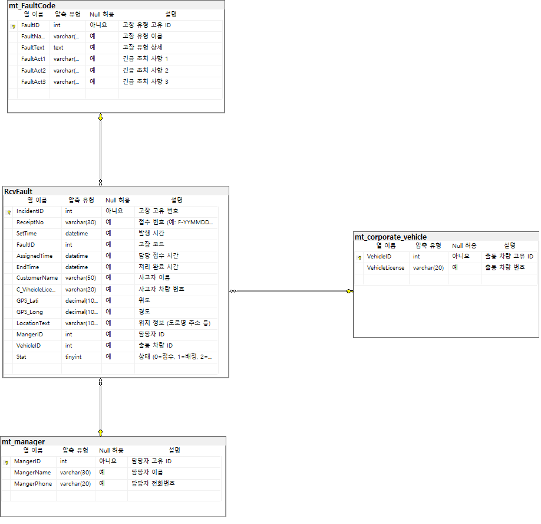

<h1 align="center">🚗 실시간 차량 사고/고장 관제 시스템</h1>

<p align="center">
  
</p>

## 📚 목차
- [🚀 시스템 구성 및 접근 방법](#-시스템-구성-및-접근-방법)
- [📌 프로젝트 개요](#-프로젝트-개요)
- [🍀 개발 목적](#-개발-목적)
- [🎥 시연 영상](#-시연-영상)
- [💻 사용 기술](#-사용-기술)
- [✅ 기능 요약](#-관제-서비스-기능-리스트)
- [📦 테이블 구조](#-테이블-구조-명세서)
- [📌 ERD 다이어그램](#-erd-다이어그램)
- [🧮 쿼리 모음](#-구성-쿼리-모음)
- [🐞 트러블슈팅](#-트러블슈팅-및-기술적-도전-과제)
- [📄 참고](#-참고)

## 🚀 시스템 구성 및 접근 방법
- 본 시스템은 **.NET 8 MVC 기반 웹 애플리케이션**으로,  
  백엔드와 프론트엔드가 하나의 프로젝트 내에서 함께 구성되어 있습니다.

- MSSQL을 통해 데이터 연동 및 실시간 알림 처리(SignalR)를 구현하였으며,  
  완성된 웹 시스템은 **AWS EC2 인스턴스에 배포되어 IIS를 통해 서비스 중**입니다.
  
🌐 [**실시간 관제 시스템 바로가기**](http://silee-portfolio1.shop)


## 📌 프로젝트 개요

이 프로젝트는 택시, 공유차량, 운송 차량 등에서 발생할 수 있는 **사고나 고장 상황을 실시간으로 감지하고**,  
지도 기반 관제 화면을 통해 관리자에게 빠르게 전달하는 시스템입니다.

- DB에 Insert 발생 시, 실시간 알림 자동 표시  
- 지도 기반 위치 시각화 및 상태 업데이트 제공  
- 관리자 관제 페이지를 통해 즉각적인 상황 파악 및 대응 가능  

운영자 입장에서 **현장 상황을 한눈에 파악할 수 있도록 도와주는 실시간 대응 지원 도구**입니다.

---

## 🍀 개발 목적

이 프로젝트는 제가 실제로 근무했던 회사에서 경험했던 시스템을 바탕으로,  
**객체지향 설계, 구조 개선, 코드 모듈화**를 목표로 새롭게 개인적으로 개발한 프로젝트입니다.

---

### 🎯 주요 목표

#### 1. **객체지향 설계 기반의 구조 개선**

기존 시스템은 절차적인 방식으로 작성되어 유지보수가 어렵고 코드가 복잡했습니다.  
본 프로젝트에서는 **.NET 8 MVC 구조에 따라 컨트롤러-서비스-DAO로 역할을 분리**하고,  
객체지향적인 코드 설계를 통해 **가독성, 유지보수성, 확장성**을 크게 개선했습니다.

---

#### 2. **자바스크립트 모듈화로 역할별 코드 분리**

실시간 알림, 지도 렌더링, 테이블 처리 등 **UI 로직을 기능별로 JS 모듈로 나누고,  
`import/export`를 통해 필요한 기능만 로딩하는 방식**으로 구성했습니다.

이를 통해 **코드의 재사용성, 유지보수성**이 향상되었고,  
관제 페이지의 기능을 보다 깔끔하게 관리할 수 있게 되었습니다.

---

#### 3. **기술 스택에 대한 실전 이해도 향상**

이전에 사용했던 기술(MSSQL, SignalR, SQL Dependency, Service Broker 등)을  
이번에는 직접 처음부터 다시 구성하며,  
**실시간 통신 처리, DB 이벤트 연동, 지도 API 연계** 등 다양한 기술적 요소를  
스스로 설계하고 구현해보며 **기술에 대한 깊이 있는 이해와 실전 감각**을 키울 수 있었습니다.


## 🎥 시연 영상

<details>
<summary><strong>💻 웹 버전 시연 보기</strong></summary>
<br>

</details>

<br>

<details>
<summary><strong>📱 모바일 버전 시연 보기</strong></summary>
<br>

</details>


## 💻 사용 기술

### 🖥️ Frontend  


---


### 🖧 Backend  


---

### 🗄️ Database  


---

### 🛠 Dev & Tools  


---

### ☁️ Deployment / Infra  


---

### 🧩 Collaboration  


✅ 관제 서비스 기능 리스트

## 🧾 사고/고장 리스트
1. 접수됨, 배정됨, 처리 완료됨 상태별 리스트 표시
2. 필터 (날짜, 지역, 상태 등)

## 🔔 고장 발생 시 알림 발생
**SQL Dependency + SignalR + Service Broker**
1. 실시간 팝업 표시 ( 우측 상단 현시 [접수번호] - 고장명 - 시간)
2. 알림 클릭 시 지도 줌 인 & 고장 요약 팝업
3. 실시간 고장 테입르 더블클릭 시 -> 팝업 현시 ( 고장 관련 정보 / 담당자 관련 정보 )

## 🗺 지도 위 고장 위치 시각화
1. Leaflet을 이용해 고장 위치 마커 표시
2. 마커 색상: 상태별 (예: 빨강=접수완료, 주황=출동중, 파랑=수리중 , 초록 = 완료)
3. 마커 클릭 시 상세 정보 툴팁

**고장 클릭시 팝업 처리로**
──────────────
🚨 [고장 유형] 엔진 이상
📍 차량번호: 12가 3456
📅 발생 시간: 2025-04-22 15:30
🗺 위치: 인천광역시 중구

👤 접수자: 이세인 (자동 등록 또는 수동 등록자)
📞 연락처: 010-XXXX-XXXX

---

🧑‍🔧 담당자: 김담당
📞 연락처: 010-XXXX-XXXX
🚗 출동 차량: 정비차량 1호
📍 현재 위치: [위치 표시 or 도착 예정]
🕐 배정 시간: 2025-04-22 15:45
──────────────

## 📊 실시간 처리 통계/카운터 현시

**상단 또는 사이드에 요약 정보 그래프 추가**

금일 발생 건수 / 처리 중 건수 / 완료 건수 / 완료율(%) / 평균 처리 시간 통계


## 📦 테이블 구조 명세서
---

### 🗂 RcvFault (고장 저장 테이블)

| 컬럼명              | 타입               | 제약조건                          | 설명                             |
|---------------------|-------------------|----------------------------------|----------------------------------|
| IncidentID          | INT               | PK, AI                           | 고장 고유 번호                    |
| ReceiptNo           | VARCHAR(30)       |                                  | 접수 번호 (F-YYMMDD-고장순번)     |
| SetTime             | DATETIME          |                                  | 발생 시간                        |
| FaultID             | INT               | FK → mt_FaultCode.FaultID        | 고장 코드                        |
| AssignedTime        | DATETIME          |                                  | 담당 접수 시간                   |
| EndTime             | DATETIME          |                                  | 처리 완료 시간                   |
| CustomerName        | VARCHAR(50)       |                                  | 사고자 이름                      |
| C_ViheicleLicense   | VARCHAR(20)       |                                  | 사고자 차량 번호                  |
| GPS_Lati            | DECIMAL(10, 6)    |                                  | 위도                             |
| GPS_Long            | DECIMAL(10, 6)    |                                  | 경도                             |
| LocationText        | VARCHAR(100)      |                                  | 위치 정보 (도로명 주소 등)         |
| MangerID            | INT               | FK → mt_manager.MangerID         | 담당자 ID                        |
| VehicleID           | INT               | FK → mt_corporate_vehicle.ID     | 출동 차량 ID                     |
| Stat                | TINYINT           |                                  | 상태 (0=접수, 1=배정, 2=완료)     |

---

### 🗂 mt_corporate_vehicle (출동 차량 테이블)

| 컬럼명         | 타입         | 제약조건 | 설명         |
|----------------|--------------|----------|--------------|
| VehicleID      | INT          | PK       | 출동 차량 고유 ID |
| VehicleLicense | VARCHAR(20)  |          | 출동 차량 번호     |

---

### 🗂 mt_manager (담당자 테이블)

| 컬럼명      | 타입         | 제약조건 | 설명         |
|-------------|--------------|----------|--------------|
| MangerID    | INT          | PK       | 담당자 고유 ID |
| MangerName  | VARCHAR(30)  |          | 담당자 이름     |
| MangerPhone | VARCHAR(20)  |          | 담당자 전화번호 |

---

### 🗂 mt_FaultCode (차량 고장 유형 코드 테이블)

| 컬럼명     | 타입         | 제약조건 | 설명               |
|------------|--------------|----------|--------------------|
| FaultID    | INT          | PK       | 고장 유형 고유 ID    |
| FaultName  | VARCHAR(50)  |          | 고장 유형 이름       |
| FaultText  | TEXT         |          | 고장 유형 상세       |
| FaultAct1  | VARCHAR(100) |          | 긴급 조치 사항 1     |
| FaultAct2  | VARCHAR(100) |          | 긴급 조치 사항 2     |
| FaultAct3  | VARCHAR(100) |          | 긴급 조치 사항 3     |


---

## 📌 ERD 다이어그램

<details>
<summary><strong>ERD 다이어그램 보기</strong></summary>
<br>


</details>

> 이 ERD(Entity-Relationship Diagram)는 고장 접수 시스템의 핵심 테이블 구조를 시각화한 다이어그램입니다.  
> 각 테이블 간의 관계는 다음과 같습니다:

- `RcvFault` : 고장 이력의 메인 테이블로, 각 고장에 대한 정보와 관련된 외래 키를 보유합니다.
  - 🔗 `FaultID` → `mt_FaultCode.FaultID` (고장 유형)
  - 🔗 `MangerID` → `mt_manager.MangerID` (처리 담당자)
  - 🔗 `VehicleID` → `mt_corporate_vehicle.VehicleID` (출동 차량)

- `mt_FaultCode` : 고장 유형 코드 정의 테이블입니다. 고장 이름, 상세 설명, 긴급 조치사항 등을 포함합니다.

- `mt_manager` : 고장 처리 담당자 정보를 담고 있는 테이블로, 이름과 연락처를 관리합니다.

- `mt_corporate_vehicle` : 고장 처리에 사용되는 출동 차량 정보를 관리하는 테이블입니다.

> 💬 이를 통해 단일 고장 데이터(`RcvFault`)가 **고장 유형**, **담당자**, **출동 차량**과 어떻게 연결되어 있는지를 시각적으로 한눈에 파악할 수 있습니다.


---

## 🧮 구성 쿼리 모음

> 아래는 이 시스템에서 활용되는 주요 프로시저 쿼리입니다.  
> 각 항목을 클릭하면 쿼리 내용을 확인할 수 있습니다.

<details>
<summary><strong>📌 PROC_RECENT_FAULT_LIST – 최근 고장 리스트 현시 </strong></summary>

<br>

```sql
create PROCEDURE [dbo].[PROC_RECENT_FAULT_LIST]

AS
BEGIN
    SET TRANSACTION ISOLATION LEVEL READ UNCOMMITTED
    SET NOCOUNT ON;

	select top 100
	a.IncidentID,a.ReceiptNo,a.SetTime,a.FaultID,b.FaultName,a.AssignedTime,a.EndTime,a.CustomerName,
	a.C_ViheicleLicense,a.GPS_Lati,a.GPS_Long,a.LocationText,a.MangerID,c.MangerName,a.VehicleID,a.Stat
	from [KORFaultWeb].[dbo].[RcvFault] as a
	left join [KORFaultWeb].[dbo].[mt_FaultCode] as b on a.FaultID = b.FaultID
	left join [KORFaultWeb].[dbo].[mt_manager] as c on a.MangerID = c.MangerID
	order by IncidentID desc;

END
```
> 최근 발생한 고장을 기준으로 고장 리스트 현시를 위한 조회 쿼리입니다.<br>
> 관제 페이지 초기 진입 시 기본 리스트로 활용됩니다.

</details>

<details>
<summary><strong>📌 PROC_RECENT_FAULT_DETAIL – 고장 리스트 클릭시 우측 하단 요약 및 조치사항 </strong></summary>

<br>

```sql
create PROCEDURE [dbo].[PROC_RECENT_FAULT_DETAIL]
    -- Add the parameters for the stored procedure here
    @IncidentID int
AS
BEGIN
    SET TRANSACTION ISOLATION LEVEL READ UNCOMMITTED
    SET NOCOUNT ON;

	select 
	a.IncidentID,a.ReceiptNo,a.SetTime,a.FaultID,b.FaultName,a.AssignedTime,a.EndTime,a.CustomerName,
	a.C_ViheicleLicense,a.GPS_Lati,a.GPS_Long,a.LocationText,a.MangerID,c.MangerName,a.VehicleID,a.Stat,
	b.FaultText, b.FaultAct1, b.FaultAct2, b.FaultAct3
	from [KORFaultWeb].[dbo].[RcvFault] as a
	left join [KORFaultWeb].[dbo].[mt_FaultCode] as b on a.FaultID = b.FaultID
	left join [KORFaultWeb].[dbo].[mt_manager] as c on a.MangerID = c.MangerID
	where a.IncidentID = @IncidentID
	order by IncidentID desc;

END
```
> 선택한 고장의 요약 정보 및 조치사항을 현시 합니다.

</details>

<details>
<summary><strong>📌 PROC_RECENT_FAULT_DETAIL_POP – 고장 더블클릭 시 팝업 구성 프로시저 </strong></summary>

<br>

```sql
create PROCEDURE [dbo].[PROC_RECENT_FAULT_DETAIL_POP]
    -- Add the parameters for the stored procedure here
    @IncidentID int
AS
BEGIN
    SET TRANSACTION ISOLATION LEVEL READ UNCOMMITTED
    SET NOCOUNT ON;

	select 
	a.IncidentID,a.ReceiptNo,a.SetTime,a.FaultID,b.FaultName,a.AssignedTime,a.EndTime,a.CustomerName,
	a.C_ViheicleLicense,a.GPS_Lati,a.GPS_Long,a.LocationText,a.MangerID,c.MangerName,a.VehicleID,a.Stat,
	b.FaultText, b.FaultAct1, b.FaultAct2, b.FaultAct3 , c.MangerPhone, e.VehicleLicense,
	(
		select count(*) from [KORFaultWeb].[dbo].[RcvFault] as d 
		where  d.MangerID = c.MangerID
		and d.SetTime >= DATEADD(DAY, 0, DATEDIFF(DAY, 0, a.SetTime))
		and d.SetTime <  DATEADD(DAY, 1, DATEDIFF(DAY, 0, a.SetTime))
	) as MangerCnt
	from [KORFaultWeb].[dbo].[RcvFault] as a
	left join [KORFaultWeb].[dbo].[mt_FaultCode] as b on a.FaultID = b.FaultID
	left join [KORFaultWeb].[dbo].[mt_manager] as c on a.MangerID = c.MangerID
	left join [KORFaultWeb].[dbo].[mt_corporate_vehicle] as e on e.VehicleID = a.VehicleID
	where a.IncidentID = @IncidentID
	order by IncidentID desc;

END
```
> 팝업 구성 요소에 값을 가져오는 프로시져

</details>

<details>
<summary><strong>📌 PROC_FAULT_STATS_TODAY –  실시간 처리 통계/카운터 현시 </strong></summary>

<br>

```sql
create PROCEDURE [dbo].[PROC_FAULT_STATS_TODAY]

AS
BEGIN
    SET TRANSACTION ISOLATION LEVEL READ UNCOMMITTED
    SET NOCOUNT ON;

	select
		count(1) as TotalCount,  -- 금일 전체 건수
		sum(case when Stat in (1, 2) then 1 else 0 end) as InProgressCount,  -- 출동중/수리중
		sum(case when Stat = 3 then 1 else 0 end) as CompletedCount,         -- 완료 건수
		cast(
			100.0 * sum(case when Stat = 3 then 1 else 0 end) 
			/ nullif(count(*), 0) 
			as decimal(5, 2)
		) as CompletedRate -- 완료율 %
	from [dbo].[RcvFault]
	where SetTime >= cast(getdate() as date);


END
```
> 실시간 처리 통계/카운터 현시를 위한 프로시져

</details>

<details> 
<summary><strong>🛠 PROC_SCH_REPEAT_INSERT – SignalR 반응을 위한 INSERT 프로시저 </strong></summary>
<br>

```sql
create PROCEDURE [dbo].[PROC_SCH_REPEAT_INSERT]

AS
BEGIN
    SET TRANSACTION ISOLATION LEVEL READ UNCOMMITTED
    SET NOCOUNT ON;

	declare @ranVe int , @ranCode int, @ranMan int
	declare @ranGPS_Lati varchar(100), @ranGPS_Long varchar(100), @ranGPS_Text varchar(100)
	declare @randomInt int, @randName varchar(100)
	declare @countToday int, @seq int, @newCode varchar(20)

	/* 차량번호 ID 랜덤 10 */
	select top 1 @ranVe = [VehicleID]
	from [KORFaultWeb].[dbo].[mt_corporate_vehicle]
	order by NEWID();
	/* 매니저 ID 랜덤 값 */
	select top 1 @ranMan = [MangerID]
	from [KORFaultWeb].[dbo].[mt_manager]
	order by NEWID();

	/* 고장코드 랜덤 값 */
	select top 1 @ranCode = [FaultID]
	from [KORFaultWeb].[dbo].[mt_FaultCode]
	order by NEWID();

	/* GPS 좌표 및 TEXT 값 */
	select top 1 @ranGPS_Lati = [GPS_Lati], @ranGPS_Long = [GPS_Long] , @ranGPS_Text = [LocationText]
	from [KORFaultWeb].[dbo].[mt_GPS_Insert_Table]
	order by NEWID();

	set @randomInt = floor(rand() * 100) + 1
	set @randName = '사고자'+ cast(@randomInt as varchar)

	declare @today CHAR(6) = CONVERT(CHAR(6), GETDATE(), 12);      -- YYMMDD
	declare @startOfDay DATETIME = CAST(CONVERT(DATE, GETDATE()) as DATETIME);
	declare @endOfDay DATETIME = DATEADD(DAY, 1, @startOfDay);

	/* F-250519-0001 같은 번호 생성기 */
	SELECT @countToday = COUNT(*)
	from [dbo].[RcvFault]
	WHERE SetTime >= @startOfDay AND SetTime < @endOfDay;

	SET @seq = @countToday + 1;
	SET @newCode = 'F-' + @today + '-' + RIGHT('0000' + CAST(@seq as varchar), 4);

	print '--- 변수 출력 ---';
	print '차량 ID         : ' + CAST(ISNULL(@ranVe, 0) as varchar);
	print '고장코드 ID     : ' + CAST(ISNULL(@ranCode, 0) as varchar);
	print '매니저 ID       : ' + CAST(ISNULL(@ranMan, 0) as varchar);
	print 'GPS 위도        : ' + ISNULL(@ranGPS_Lati, '');
	print 'GPS 경도        : ' + ISNULL(@ranGPS_Long, '');
	print 'GPS 위치 설명   : ' + ISNULL(@ranGPS_Text, '');
	print '랜덤 숫자       : ' + CAST(ISNULL(@randomInt, 0) as varchar);
	print '랜덤 이름       : ' + ISNULL(@randName, '');
	print '오늘 삽입 건수  : ' + CAST(ISNULL(@countToday, 0) as varchar);
	print '시퀀스 번호     : ' + CAST(ISNULL(@seq, 0) as varchar);
	print '생성된 코드     : ' + ISNULL(@newCode, '');


	INSERT INTO RcvFault (
		ReceiptNo, SetTime, FaultID, AssignedTime, EndTime,
		CustomerName, C_ViheicleLicense, GPS_Lati, GPS_Long, LocationText,
		MangerID, VehicleID, Stat
	)
	VALUES (
		@newCode ,GetDate(), @ranCode, GetDate(), NULL,
		@randName, '269조5969', @ranGPS_Lati, @ranGPS_Long, @ranGPS_Text,
		@ranMan, @ranVe, 0
	);
  
	/* stat 1 = 출동 중 */
	update [dbo].[RcvFault] set Stat = 1 where SetTime >= dateadd(minute, -3, getdate()) and SetTime <  dateadd(minute, -1, getdate());
	/* stat 2 = 출동 중 */
	update [dbo].[RcvFault] set Stat = 2 where SetTime >= dateadd(minute, -5, getdate()) and SetTime <  dateadd(minute, -3, getdate());
	/* stat 3 = 완료 */
	update [dbo].[RcvFault] set Stat = 3, EndTime = GetDate() where SetTime < dateadd(minute, -6, getdate()) and EndTime is null;
END
```
> SQL Server Agent 작업을 통해 10초마다 자동 실행되도록 설정된 SignalR 반응용 실시간 삽입 프로시저입니다.<br>
> 실시간 알림 및 지도 반응 기능을 검증하기 위한 더미 데이터 생성에 활용됩니다.

</details>

---

## 🐞 트러블슈팅 및 기술적 도전 과제

<details>
<summary><strong>📡 SignalR 실시간 알림 미작동 문제</strong></summary>
<br>

### 🔍 문제 상황  
`SqlDependency`를 적용했음에도 **DB에 INSERT가 발생해도 클라이언트 측 알림이 발생하지 않는 현상**이 있었습니다.

---

### 🧩 원인 분석  
쿼리문에 **3파트 식별자(데이터베이스명.스키마명.테이블명)** 를 사용한 것이 원인이었습니다:

```sql
-- ❌ 잘못된 예시
SELECT [IncidentID] FROM [KORFaultWeb].[dbo].[RcvFault]

-- ✅ 올바른 예시
SELECT [IncidentID] FROM [dbo].[RcvFault]

```

### 📌 요약
> SqlDependency는 현재 연결된 DB 내의 테이블만 감시할 수 있습니다.
> DB명을 포함한 쿼리는 무시되며 알림이 발생하지 않습니다. ( SSMS에서는 정상 동작 )
> Initial Catalog와 쿼리 대상 테이블의 DB가 반드시 일치해야 합니다.

### 🔗 참고 자료

- 📄 [SqlDependency Constructor – Microsoft Docs](https://stackoverflow.com/questions/7588572/what-are-the-limitations-of-sqldependency)
</details>

---

<details>
<summary><strong>🛠 AWS RDS 환경에서 SqlDependency 미작동 문제</strong></summary>
<br>

### 🔍 문제 상황
- AWS EC2 + RDS(MSSQL) 환경에서 실시간 알림용 `SqlDependency` 적용 시, 알림이 전혀 발생하지 않음

### 🧩 원인 분석
- RDS는 MSSQL의 **Service Broker** 및 **Query Notification** 관련 기능이 **제한적** 또는 **비활성화**되어 있음
- 특히 `ENABLE_BROKER` 명령 등 일부 제어 불가

### ✅ 해결 방법
- EC2 인스턴스에 **MSSQL 직접 설치**
- `ENABLE_BROKER`, `SqlDependency`, `Service Broker` 설정 후 사용
- IIS 환경에 ASP.NET 앱 배포 → 정상 작동 확인

### 📝 참고
- RDS의 SQL Server는 기본적으로 **Service Broker 비활성화**됨
- 실시간 알림(Query Notification), Linked Server 등 기능이 필요할 경우 **직접 설치된 SQL Server 사용** 필요

</details>


## 📄 참고

이 프로젝트는 MIT License 기반의 [AdminLTE 4.0.0-beta3](https://adminlte.io/) 템플릿을 커스터마이징하여 UI를 구성하였습니다.

